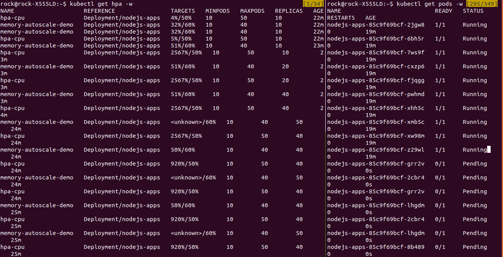

# EKS-with-Autoscale

## Getting Started setup EKS cluster on AWS

First of all setup EKS by writing cluster.yaml file and run it with following command

``` kubectl apply -f cluster.yaml ```

**OUTPUTS**


Next step is Setting metrics server in kubernetes for checking CPU and Memory usage using this link 

``` kubectl apply -f https://github.com/kubernetes-sigs/metrics-server/releases/download/v0.3.7/components.yaml ```


For storing Docker images i used AWS ECR which is private docker registry. 


After that run Deployment and service Mainfest file which is exposed through Loadbalancer with port 3000. 

``` kubectl apply -f deployment.yaml ```

``` kubectl apply -f service.yaml ```

Then run HPA (Horizontal Pod Autoscaler) file for CPU and Memory Mainfest file and the thresold will be 50% CPU and 60% Memory.
 
``` kubectl apply -f hpa-cpu.yaml ```

``` kubectl apply -f hpa-memory.yaml ```

**OUTPUTS FOR CPU AND MEMORY UTILIZATION**


## Load testing using siege and Jmeter Tool.

1. For siege requsting 250 user with this command:- ``` siege -q -c 250 -t 1m  http://mywebsite.com ```
2. For Jmeter using this command:-                  ``` jmeter -n -t ./report.jmx -l ./report.csv ```
3. For Generating the Report in HTML format:-       ``` jmeter -n -t ./report.jmx -l ./report.csv -e -o ./Jmeter-HTML-Report ``` 


**OUTPUTS FOR LOAD INCREASE**




